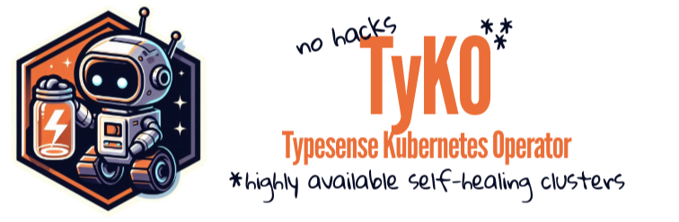

<p align="left">
  
</p>

[//]: # (# TyKO — Typesense Kubernetes Operator)

[//]: # (**Kubernetes-native automation for highly available Typesense clusters.**)

[]() []()
[]()   []()

[//]: # (---)

## 🎯 Why TyKO?

**Simplify the deployment, scaling, and management of Typesense clusters in Kubernetes.**

- Deploy highly-available **Typesense** clusters with a **single declarative YAML manifest**
- Automates **Typesense** [lifecycle management](https://akyriako.github.io/typesense-operator-docs/docs/getting-started#key-features) (config maps, secrets, volumes, statefulsets, services, ingress, metrics, scrapers)
- Automates **Raft quorum [configuration, discovery and recovery](https://akyriako.github.io/typesense-operator-docs/docs/how-it-works/recovering-a-cluster-that-has-lost-quorum)** without additional sidecars or manual interventions
- Built with Go & Operator SDK — lightweight, Kubernetes-native, and flexible
- Community-driven, with plethora of examples for Kind, CCE, AKS, EKS, GCP, and more

## ⚡ Get Started

```bash
# Install the Operator
helm repo add tyko https://akyriako.github.io/typesense-operator/
helm repo update

helm upgrade --install typesense-operator tyko/typesense-operator -n typesense-system --create-namespace
```

<details>
<summary>Quick example for Open Telekom Cloud CCE</summary>

```yaml
apiVersion: ts.opentelekomcloud.com/v1alpha1
kind: TypesenseCluster
metadata:
  labels:
    app.kubernetes.io/name: typesense-operator
    app.kubernetes.io/managed-by: kustomize
  name: ts-cce
spec:
  image: typesense/typesense:29.0
  replicas: 3
  storage:
    storageClassName: csi-disk
```
</details>

<details>
<summary>Quick example for Kind</summary>

```yaml
apiVersion: storage.k8s.io/v1
kind: StorageClass
metadata:
  name: typesense-local-path
provisioner: rancher.io/local-path
reclaimPolicy: Delete
allowVolumeExpansion: true
volumeBindingMode: WaitForFirstConsumer
---
apiVersion: ts.opentelekomcloud.com/v1alpha1
kind: TypesenseCluster
metadata:
  labels:
    app.kubernetes.io/name: typesense-operator
    app.kubernetes.io/managed-by: kustomize
  name: ts-kind
spec:
  image: typesense/typesense:29.0
  replicas: 3
  storage:
    size: 150Mi
    storageClassName: typesense-local-path
```
</details>

<details>
<summary>Quick example for AWS EKS</summary>

```yaml
apiVersion: ts.opentelekomcloud.com/v1alpha1
kind: TypesenseCluster
metadata:
  labels:
    app.kubernetes.io/name: typesense-operator
    app.kubernetes.io/managed-by: kustomize
  name: ts-aws
spec:
  image: typesense/typesense:29.0
  replicas: 3
  storage:
    size: 100Mi
    storageClassName: gp2
```
</details>

<details>
<summary>Quick example for Azure AKS</summary>

```yaml
apiVersion: ts.opentelekomcloud.com/v1alpha1
kind: TypesenseCluster
metadata:
  labels:
    app.kubernetes.io/name: typesense-operator
    app.kubernetes.io/managed-by: kustomize
  name: ts-azure
spec:
  image: typesense/typesense:29.0
  replicas: 3
  storage:
    storageClassName: managed-csi
```
</details>

<details>
<summary>Quick example for GCP</summary>

```yaml
apiVersion: ts.opentelekomcloud.com/v1alpha1
kind: TypesenseCluster
metadata:
  labels:
    app.kubernetes.io/name: typesense-operator
    app.kubernetes.io/managed-by: kustomize
  name: ts-gcp
spec:
  image: typesense/typesense:29.0
  replicas: 3
  storage:
    storageClassName: standard-rwo
```
</details>

You can find more examples and analytical installation instructions in the [Installation](https://akyriako.github.io/typesense-operator-docs/docs/installation/) and [Configuration](https://akyriako.github.io/typesense-operator-docs/docs/crds) guides.

## 📚 Documentation

- [Getting Started](https://akyriako.github.io/typesense-operator-docs/docs/getting-started)
- [How it works](https://akyriako.github.io/typesense-operator-docs/docs/how-it-works)
- [Configuration & CRD Specs](https://akyriako.github.io/typesense-operator-docs/docs/crds)
- [Monitoring & Metrics](https://akyriako.github.io/typesense-operator-docs/docs/metrics)

## 💬 Community & Support

Join the conversation:
- **GitHub Discussions**: ask questions, share feedback, submit suggestions or help others
- **Issues**: report bugs or request features

## 📦 Project Status

TyKO is an **independently maintained** project (not affiliated with Typesense, Inc.).
- Latest version: **0.3.3**
- Tested on: Kubernetes 1.33 (earliest 1.26), Typesense 29.0 (earliest 26.0)
- Contributions welcome! See [FAQ](https://akyriako.github.io/typesense-operator-docs/docs/faq) and [Development](https://akyriako.github.io/typesense-operator-docs/docs/development)

## ⭐ Help us Grow
- Star the repo if you want this operator to grow
- Try TyKO in your own infrastructure and share your feedback or list yourselves as [Adopters](https://akyriako.github.io/typesense-operator-docs/docs/adopters)
- Spread the word: blog posts, tutorials, or community shoutouts help others discover it